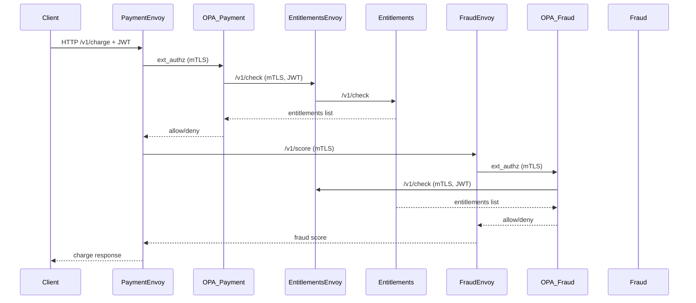
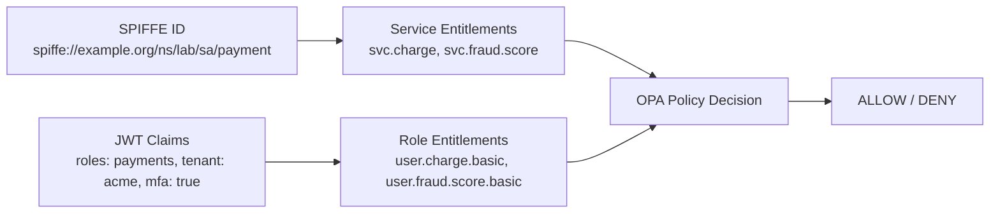

# SPIRE + SPIFFE + Envoy + OPA lab (kind)

This lab spins up a local k8s environment that demonstrates:

- SPIRE issuing SPIFFE identities to workloads
- Envoy sidecars enforcing mTLS between services
- Dedicated OPA services enforcing fine‑grained AuthZ
- Entitlements service as a repository for service entitlements + JWT role entitlements
- End‑to‑end request evaluation using both SPIFFE identity and JWT claims

Two services are provided:

- `payment` (inbound authz + calls fraud)
- `fraud` (only accepts mTLS from payment)
- `entitlements` (repository for SPIFFE + role entitlements)
- `opa-payment` / `opa-fraud` (dedicated policy engines)

## Prereqs

- `docker`
- `kind`
- `kubectl`
- `helm`

## Quickstart

1. Create a kind cluster

```bash
./scripts/kind-up.sh
```

2. Install SPIRE via Helm

```bash
./scripts/install-spire.sh
```

3. Build and load the service images

```bash
./scripts/build-images.sh
```

4. Deploy apps and config

```bash
./scripts/deploy-apps.sh
```

5. Register SPIFFE IDs for the workloads

```bash
./scripts/register-entries.sh
```

## Try it

Port‑forward the payment service:

```bash
kubectl -n lab port-forward svc/payment 8080:8080
```

Generate a JWT and store the signing secret in Kubernetes:

```bash
./scripts/gen-jwt.sh
```

Then export the JWT printed by the script:

```bash
export AUTH_TOKEN="..."
```

Allowed request (silver tier, amount <= 1000):

```bash
curl -s -X POST http://localhost:8080/v1/charge \
  -H 'content-type: application/json' \
  -H "authorization: Bearer ${AUTH_TOKEN}" \
  -H 'x-user-role: payments' \
  -H 'x-merchant-tier: silver' \
  -d '{"amount":900,"currency":"USD","card_country":"US","merchant_id":"m-123","user_id":"u-456"}' | jq
```

Denied by payment OPA (amount too high for non‑gold):

```bash
curl -i -X POST http://localhost:8080/v1/charge \
  -H 'content-type: application/json' \
  -H "authorization: Bearer ${AUTH_TOKEN}" \
  -H 'x-user-role: payments' \
  -H 'x-merchant-tier: silver' \
  -d '{"amount":2500,"currency":"USD","card_country":"US","merchant_id":"m-123","user_id":"u-456"}'
```

Denied by fraud OPA (amount too high for fraud policy):

```bash
curl -i -X POST http://localhost:8080/v1/charge \
  -H 'content-type: application/json' \
  -H "authorization: Bearer ${AUTH_TOKEN}" \
  -H 'x-user-role: payments' \
  -H 'x-merchant-tier: silver' \
  -d '{"amount":1500,"currency":"USD","card_country":"US","merchant_id":"m-123","user_id":"u-456"}'
```

Check OPA decision logs:

```bash
kubectl -n lab logs deploy/opa-payment -c opa --tail=50
kubectl -n lab logs deploy/opa-fraud -c opa --tail=50
```

## Architecture

### High-Level Flow



### Identity & Entitlements



## SPIFFE IDs

The lab assumes the SPIRE trust domain is `example.org` and registers:

- `spiffe://example.org/ns/lab/sa/payment`
- `spiffe://example.org/ns/lab/sa/fraud`
- `spiffe://example.org/ns/lab/sa/client`
- `spiffe://example.org/ns/lab/sa/opa-payment`
- `spiffe://example.org/ns/lab/sa/opa-fraud`
- `spiffe://example.org/ns/lab/sa/entitlements`

If your trust domain is different, update the SPIFFE IDs in:

- `k8s/payment-config.yaml`
- `k8s/fraud-config.yaml`
- `scripts/register-entries.sh`

## Notes

- `payment` calls `fraud` through Envoy on `127.0.0.1:15001`, so all traffic uses mTLS.
- Envoy pulls SVIDs from the SPIFFE CSI socket at `/spiffe-workload-api/spire-agent.sock`.
- `payment` and `fraud` Envoy sidecars call OPA over mTLS.
- OPA uses Envoy egress on `127.0.0.1:15002` to call the entitlements service over mTLS.
- OPA policies inspect headers and JSON request bodies to enforce business rules and entitlements.
- Rego policies live in `policies/payment.rego` and `policies/fraud.rego` and are loaded into ConfigMaps by `scripts/deploy-apps.sh`.
- For stronger integrity, entitlements could return a signed JWT or a signature over the response body so OPA can verify it and mitigate MITM or DNS spoofing risks.
- JWT verification secrets are stored in the `jwt-secret` Kubernetes secret and injected into OPA and entitlements via env vars.

## Troubleshooting

- If requests are denied, check OPA decision logs:
  - `kubectl -n lab logs deploy/opa-payment -c opa --tail=50`
  - `kubectl -n lab logs deploy/opa-fraud -c opa --tail=50`
- If entitlements aren’t being hit, check:
  - `kubectl -n lab logs deploy/entitlements -c entitlements --tail=50`
  - `kubectl -n lab logs deploy/entitlements -c envoy --tail=50`
