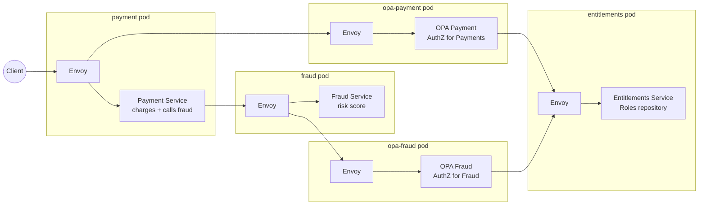
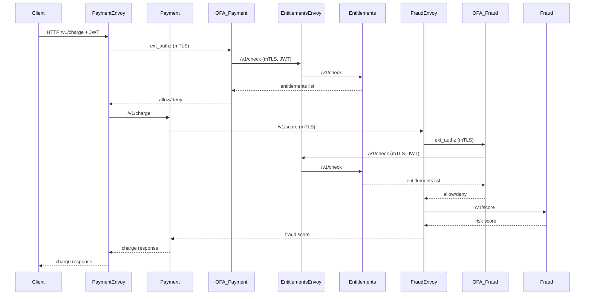
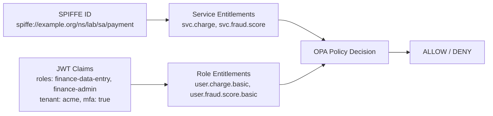

# Envoy + OPA lab

_OpenAI's Codex was heavily used in creating this lab_

## Overview
This lab aims to help illustrate how AuthZ enforcment can be a platform responsibility rather than an application code responsibility. It uses Envoy's ext_authz plugin to push decision making to OPA. This is a highly scalable way to enforce intelligent authorization at runtime within the service mesh.

It differs from traditional intentions based mesh authz approaches as the OPA decision code has the full context of the HTTP request rather than just knowing source / destination / URI. This means OPA decisions can be based on the request body, the authorization header, or even by sourcing additional metadata from an external service. This lab showcases this with a very simple "entitlement service" that stores additional metadata and mapping of JWT claims to roles. Using OPA in this way is not mutually exclusive with other service mesh ways of doing authz and they can work in concert (mesh does simple intentions based networking and OPA is only used when more intelligent based rules are needed).

The idea is that application teams would still own the "rules of engagement" with their applications by owning the rego code that OPA executes. The platform would pull those rules in via the deployment pipeline and push them out to the running OPA agents. Therefore the platform owns rule enforcement, but the app teams own the rules. This also has the side benefit of being able to update authz rules without having to redeploy the application, all that needs to be updated are the rules in the corollary OPA.

This could be implemented in a brown-field as long as the envoy service mesh can be established with the OPA plugin. Once that plumbing is in place, rules can be added one at a time until eventually the entire authz ruleset exists in rego.

Another benefit of this approach is that OPA logs every decision. Being able to audit and attest authz decisions across an entire compute estate is a huge win for many regulated industries. Today there is very little tooling / support for this.

While rego isn't a perfect language and will likely break down in some very complex authz decisions, the app teams can always fail back to authz rules in code. However with this approach, there's now a standard policy language across all app teams for authz. In larger companies where polyglot development is common, this is a huge win for consistency and enables security teams to scale audits across all applications.

## Setup

This lab spins up a local k8s environment that demonstrates:

- SPIRE issuing SPIFFE identities to workloads
- Envoy sidecars enforcing mTLS between services
- Dedicated OPA services enforcing fine‑grained AuthZ
- Entitlements service as a repository for service entitlements + JWT role entitlements
- End‑to‑end request evaluation using both SPIFFE identity and JWT claims

Services:

- `payment` (inbound authz + calls fraud)
- `fraud` (only accepts mTLS from payment)
- `entitlements` (repository for SPIFFE + role entitlements)
- `opa-payment` / `opa-fraud` (dedicated policy engines)

## Prereqs

- `docker`
- `kind`
- `kubectl`
- `helm`
- `python3` (for JWT generation)
- `openssl` (for ES256 signing)

## Quickstart

1. Create a kind cluster

```bash
./scripts/kind-up.sh
```

2. Install SPIRE via Helm

```bash
./scripts/install-spire.sh
```

3. Build and load the service images

```bash
./scripts/build-images.sh
```

4. Generate JWTs and publish the signing certificate

This creates the `jwt-cert` Kubernetes secret and prints two JWTs for your shell.
OPA and entitlements read `JWT_CERT` at startup, so this must happen before
deploying them (or you must restart those pods after running it).

```bash
eval "$(./scripts/gen-jwt.sh)"
```

5. Deploy apps and config

```bash
./scripts/deploy-apps.sh
```

6. Register SPIFFE IDs for the workloads

```bash
./scripts/register-entries.sh
```

## Try it

**In another shell**, port‑forward the payment service:

```bash
kubectl -n lab port-forward svc/payment 8080:8080
```

Allowed request (basic user, amount <= 100):

```bash
curl -s -X POST http://localhost:8080/v1/charge \
  -H 'content-type: application/json' \
  -H "authorization: Bearer ${BASIC_AUTH_TOKEN}" \
  -d '{"amount":99,"currency":"USD","card_country":"US","merchant_id":"m-123"}'
```

Denied by payment OPA (basic user over limit):

```bash
curl -i -X POST http://localhost:8080/v1/charge \
  -H 'content-type: application/json' \
  -H "authorization: Bearer ${BASIC_AUTH_TOKEN}" \
  -d '{"amount":199,"currency":"USD","card_country":"US","merchant_id":"m-123"}'
```

Denied by fraud OPA (riskier merchant, low fraud threshold):

```bash
curl -i -X POST http://localhost:8080/v1/charge \
  -H 'content-type: application/json' \
  -H "authorization: Bearer ${ADMIN_AUTH_TOKEN}" \
  -d '{"amount":600,"currency":"USD","card_country":"US","merchant_id":"m-gambling"}'
```

Admin succeeds where basic fails (same request, different token):

```bash
# BASIC (fails)
curl -i -X POST http://localhost:8080/v1/charge \
  -H 'content-type: application/json' \
  -H "authorization: Bearer ${BASIC_AUTH_TOKEN}" \
  -d '{"amount":199,"currency":"USD","card_country":"US","merchant_id":"m-123"}'

# ADMIN (succeeds)
curl -i -X POST http://localhost:8080/v1/charge \
  -H 'content-type: application/json' \
  -H "authorization: Bearer ${ADMIN_AUTH_TOKEN}" \
  -d '{"amount":199,"currency":"USD","card_country":"US","merchant_id":"m-123"}'
```

Admin still fails on m-gambling above $500:

```bash
curl -i -X POST http://localhost:8080/v1/charge \
  -H 'content-type: application/json' \
  -H "authorization: Bearer ${ADMIN_AUTH_TOKEN}" \
  -d '{"amount":600,"currency":"USD","card_country":"US","merchant_id":"m-gambling"}'
```

Check OPA decision logs:

```bash
kubectl -n lab logs deploy/opa-payment -c opa --tail=100 | grep decision_id | jq
kubectl -n lab logs deploy/opa-fraud -c opa --tail=100 | grep decision_id | jq
```

## Architecture

### High-Level Architecture



### High-Level Flow




### Identity & Entitlements



## SPIFFE IDs

The lab assumes the SPIRE trust domain is `example.org` and registers:

- `spiffe://example.org/ns/lab/sa/payment`
- `spiffe://example.org/ns/lab/sa/fraud`
- `spiffe://example.org/ns/lab/sa/opa-payment`
- `spiffe://example.org/ns/lab/sa/opa-fraud`
- `spiffe://example.org/ns/lab/sa/entitlements`

## Notes

- `payment` calls `fraud` through Envoy on `127.0.0.1:15001`, so all traffic uses mTLS.
- Envoy pulls SVIDs from the SPIFFE CSI socket at `/spiffe-workload-api/spire-agent.sock`.
- `payment` and `fraud` Envoy sidecars call OPA over mTLS.
- OPA uses Envoy egress on `127.0.0.1:15002` to call the entitlements service over mTLS.
- Entitlements derives the caller SPIFFE ID from mTLS (`x-forwarded-client-cert`) and rejects mismatches.
- OPA policies inspect JWT claims and JSON request bodies to enforce business rules and entitlements.
- Rego policies live in `policies/payment.rego` and `policies/fraud.rego` and are loaded into ConfigMaps by `scripts/deploy-apps.sh`.
- For stronger integrity, entitlements could return a signed JWT or a signature over the response body so OPA can verify it and mitigate MITM or DNS spoofing risks.
- JWT verification certificates are stored in the `jwt-cert` Kubernetes secret and injected into OPA and entitlements via env vars.
