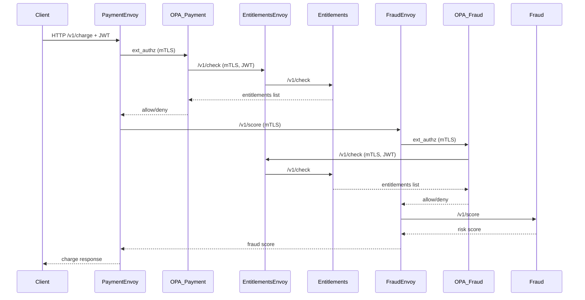

# SPIRE + SPIFFE + Envoy + OPA lab (kind)

_OpenAI's Codex was heavily used in creating this lab_

This lab spins up a local k8s environment that demonstrates:

- SPIRE issuing SPIFFE identities to workloads
- Envoy sidecars enforcing mTLS between services
- Dedicated OPA services enforcing fine‑grained AuthZ
- Entitlements service as a repository for service entitlements + JWT role entitlements
- End‑to‑end request evaluation using both SPIFFE identity and JWT claims

Services:

- `payment` (inbound authz + calls fraud)
- `fraud` (only accepts mTLS from payment)
- `entitlements` (repository for SPIFFE + role entitlements)
- `opa-payment` / `opa-fraud` (dedicated policy engines)

## Prereqs

- `docker`
- `kind`
- `kubectl`
- `helm`
- `python3` (for JWT generation)
- `openssl` (for ES256 signing)

## Quickstart

1. Create a kind cluster

```bash
./scripts/kind-up.sh
```

2. Install SPIRE via Helm

```bash
./scripts/install-spire.sh
```

3. Build and load the service images

```bash
./scripts/build-images.sh
```

4. Deploy apps and config

```bash
./scripts/deploy-apps.sh
```

5. Register SPIFFE IDs for the workloads

```bash
./scripts/register-entries.sh
```

## Try it

Port‑forward the payment service:

```bash
kubectl -n lab port-forward svc/payment 8080:8080
```


Generate ES256 JWTs, store the public signing certificate in Kubernetes, and export the JWTs printed by the script:

```bash
eval "$(./scripts/gen-jwt.sh)"
```

Allowed request (basic user, amount <= 100):

```bash
curl -s -X POST http://localhost:8080/v1/charge \
  -H 'content-type: application/json' \
  -H "authorization: Bearer ${BASIC_AUTH_TOKEN}" \
  -d '{"amount":99,"currency":"USD","card_country":"US","merchant_id":"m-123"}'
```

Denied by payment OPA (basic user over limit):

```bash
curl -i -X POST http://localhost:8080/v1/charge \
  -H 'content-type: application/json' \
  -H "authorization: Bearer ${BASIC_AUTH_TOKEN}" \
  -d '{"amount":199,"currency":"USD","card_country":"US","merchant_id":"m-123"}'
```

Denied by fraud OPA (riskier merchant, low fraud threshold):

```bash
curl -i -X POST http://localhost:8080/v1/charge \
  -H 'content-type: application/json' \
  -H "authorization: Bearer ${ADMIN_AUTH_TOKEN}" \
  -d '{"amount":600,"currency":"USD","card_country":"US","merchant_id":"m-gambling"}'
```

Admin succeeds where basic fails (same request, different token):

```bash
# BASIC (fails)
curl -i -X POST http://localhost:8080/v1/charge \
  -H 'content-type: application/json' \
  -H "authorization: Bearer ${BASIC_AUTH_TOKEN}" \
  -d '{"amount":199,"currency":"USD","card_country":"US","merchant_id":"m-123"}'

# ADMIN (succeeds)
curl -i -X POST http://localhost:8080/v1/charge \
  -H 'content-type: application/json' \
  -H "authorization: Bearer ${ADMIN_AUTH_TOKEN}" \
  -d '{"amount":199,"currency":"USD","card_country":"US","merchant_id":"m-123"}'
```

Admin still fails on m-gambling above $500:

```bash
curl -i -X POST http://localhost:8080/v1/charge \
  -H 'content-type: application/json' \
  -H "authorization: Bearer ${ADMIN_AUTH_TOKEN}" \
  -d '{"amount":600,"currency":"USD","card_country":"US","merchant_id":"m-gambling"}'
```

Check OPA decision logs:

```bash
kubectl -n lab logs deploy/opa-payment -c opa --tail=5
kubectl -n lab logs deploy/opa-fraud -c opa --tail=5
```

## Architecture

### High-Level Flow




### Identity & Entitlements

```mermaid
flowchart LR
    A[SPIFFE ID<br/>spiffe://example.org/ns/lab/sa/payment] --> B[Service Entitlements<br/>svc.charge, svc.fraud.score]
    C[JWT Claims<br/>roles: finance-data-entry|finance-admin, tenant: acme, mfa: true] --> D[Role Entitlements<br/>user.charge.basic, user.fraud.score.basic]
    B --> E[OPA Policy Decision]
    D --> E
    E --> F[ALLOW / DENY]
```

## SPIFFE IDs

The lab assumes the SPIRE trust domain is `example.org` and registers:

- `spiffe://example.org/ns/lab/sa/payment`
- `spiffe://example.org/ns/lab/sa/fraud`
- `spiffe://example.org/ns/lab/sa/opa-payment`
- `spiffe://example.org/ns/lab/sa/opa-fraud`
- `spiffe://example.org/ns/lab/sa/entitlements`

## Notes

- `payment` calls `fraud` through Envoy on `127.0.0.1:15001`, so all traffic uses mTLS.
- Envoy pulls SVIDs from the SPIFFE CSI socket at `/spiffe-workload-api/spire-agent.sock`.
- `payment` and `fraud` Envoy sidecars call OPA over mTLS.
- OPA uses Envoy egress on `127.0.0.1:15002` to call the entitlements service over mTLS.
- Entitlements derives the caller SPIFFE ID from mTLS (`x-forwarded-client-cert`) and rejects mismatches.
- OPA policies inspect JWT claims and JSON request bodies to enforce business rules and entitlements.
- Rego policies live in `policies/payment.rego` and `policies/fraud.rego` and are loaded into ConfigMaps by `scripts/deploy-apps.sh`.
- For stronger integrity, entitlements could return a signed JWT or a signature over the response body so OPA can verify it and mitigate MITM or DNS spoofing risks.
- JWT verification certificates are stored in the `jwt-cert` Kubernetes secret and injected into OPA and entitlements via env vars.
